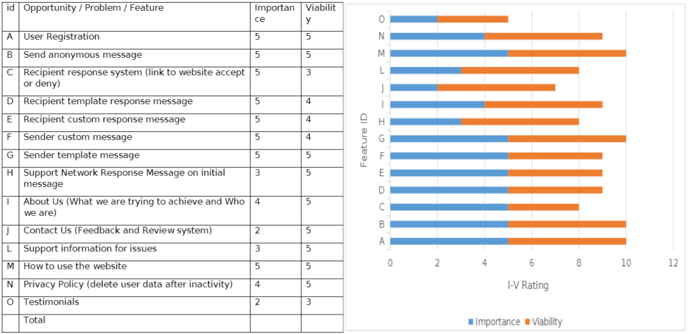
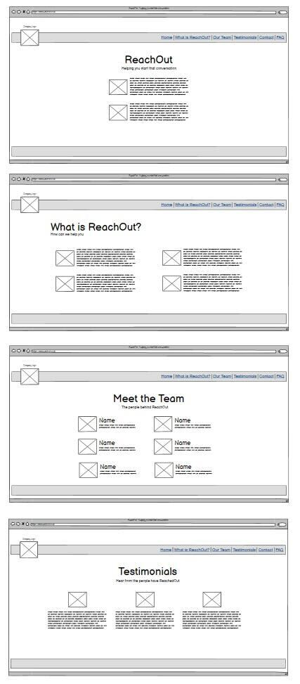
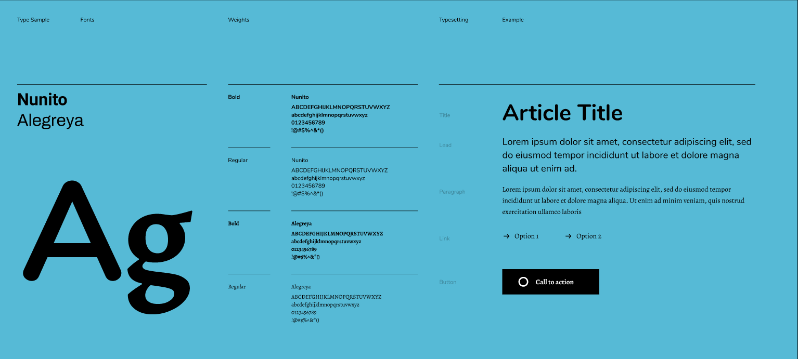
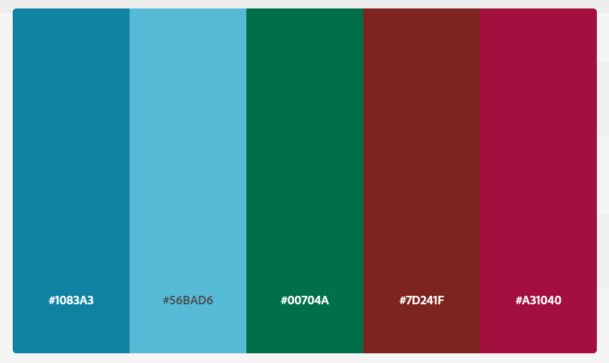

A project that aims to help struggling people take the first steps in reaching out to talk to their friends and family for support.

This project is a collaborative effort, made possible by:

Abhisek Joshi  | Baiju Abraham  | Chris Lawbuary  | Joy Zadan  | Nick Lennon  | Sam Dainton 

## Contents

Table of Contents - Click to Expand

- [About](#about)
- [UX Design](#ux-design-and-planning)
  - [User Stories](#user-stories)
  - [Features and Scope Planning](#features-and-scope-planning)
  - [Wireframes](#wireframes)
  - [Typography](#typography)
  - [Colors](#color-scheme)
- [Features Implemented](#features-implemented)
- [Technologies Used](#technologies-used)
- [Testing](#testing)
  - [Validation Results](#validation-results)
- [Deployment](#deployment)
  - [GitHub Pages](#github-pages)
  - [Forking the GitHub Repository](#forking-the-github-repository)
  - [Making a Local Clone](#making-a-local-clone)
  - [Gitpod](#gitpod)
- [Credits](#credits)
  - [Content](#content)
  - [Media](#media)
  - [Content](#further-learning)

-----

## About
Reach Out is a project designed with the hopes of giving confidence to people who are struggling with a difficult topics of conversation by starting that conversation with someone important to them anonymously. This may include a young person who wants to talk to their parent about gender identity, someone who is suffering with mental illness and isn't confident that their friends would be willing to listen or perhaps a person who is feeling isolated and alone. We believe there are many people out there who first need to hear that their family and friends are happy for them to reach out and connect so that they can get the support they need from the people that matter most.

-----

## UX Design and Planning

### User Stories
- As a user I want to send a message to someone I know, inviting them to talk.

- I want the message to be anonymous, it will be at my discretion to reveal my identity.

- As a website we will need users to create accounts and verify their age and email for security.

- As a user I would like to be able to change my password and delete my account.

- As a user I would like ideas on how to create my message or see examples from the past to give me confidence.

- As the initiator or the recipient of the conversation, I need the website to appear professional and trustworthy.

### Target Demographic
We hope that the project will reach a wide range of demographics unbound by race, sexuality, class, social background, the list goes on. Ultimately, it is up to the users on how they use the website and the issues they are dealing with, but we hope that with enough information and encouragement people of all varieties will make great progress on their struggles from the platform.

### Features and Scope Planning

### Wireframes

The finished website ended up looking quite different to our initial ideas. But the initial ideas helped build what we ended up with and we are happy with the new design choices taken.

### Typography

The fonts chosen are Nunito and Alegreya from google fonts.

### Color Scheme
We dicided upon a deep green and complimentary blue as the main colors of choice for the project. Green and Blue are said to have calming effects and are often considered refreshing, relaxing colours. Green has also been found to positively influence not only our emotions but our memories as well and Blue is often seen as a sign of stability and reliability.

-----

## Features Implemented
Featured Implemented Upon Project Completion

- User Registration
- How to use
- Ability to sent custom/template message anonymously
- Private chat using generated code
- About us
- Support links
- Testimonials

-----

## Technologies Used
This project makes use of the following languages, frameworks, and libraries:

 Languages and Libraries

- [Django](https://www.djangoproject.com/) - Python Framework
- [HTML5](https://developer.mozilla.org/en-US/docs/Glossary/HTML5) - Programming Language
- [CSS 3](https://developer.mozilla.org/en-US/docs/Web/CSS) - Programming Language
- [Python](https://www.python.org/) - Programming Language
- [Jinja](https://jinja.palletsprojects.com/en/3.0.x/) - Template Language
- [jQuery](https://jquery.com/) - JavaScript Library
- [Bootstrap v5](https://getbootstrap.com/) - Library Import
- [Google Fonts](https://fonts.google.com/) - Typography Import
- [Font Awesome](https://fontawesome.com/) - Icon provider

 IDE and Version Control

- [Git Pod](https://gitpod.io/) - IDE (Integrated Development Environment)
- [Git](https://git-scm.com/) - Version Control Tool
- [Github](https://github.com/) - Cloud based hosting service to manager my Git Repositories
- [Code Institute GitPod Template](https://github.com/Code-Institute-Org/gitpod-full-template) - Provides GitPod extensions to help with code production

 Design and Development

- [Google Chrome Development Tools](https://developer.chrome.com/docs/devtools/) - Design/Development Tools
- [Balsamiq](https://balsamiq.com/) - Wireframe designer software
- [Coolors](https://coolors.co/) - Colour scheme generator
- [Lucid App](https://lucid.app/) - Diagram creator
- [CloudConvert](https://cloudconvert.com/png-to-webp) - Image converter used to convert png images to webp

 Validation and Testing

- [CSS Beautifier](https://www.freeformatter.com/css-beautifier.html) - Beautifying CSS Code
- [JavaScript Validator](https://beautifytools.com/javascript-validator.php) - Validating JS code
- [Am I Responsive?](http://ami.responsivedesign.is/) - Webpage Breakpoint visualizer and image generator
- [Black](https://black.readthedocs.io/en/stable/)- Code Formatter
- [W3C CSS Validation Service](https://jigsaw.w3.org/css-validator/)
- [Browser Stack Responsive Design Tester](https://www.browserstack.com/responsive)
- [Media Genesis RESPONSIVE WEB DESIGN CHECKER](https://responsivedesignchecker.com/)
- [Chrome Dev Tools](https://developer.chrome.com/docs/devtools/)
- [Lighthouse](https://developers.google.com/web/tools/lighthouse)
- [pylint](https://pylint.org/)

-----

## Testing

### Validation Results
HTML

HTML Validation returned with a number of errors, but nothing that would break the project as the errors being returned were the validator not recognizing how we were linking to images.

CSS

Validation was performed using the W3C CSS validation service which returned no errors.

Lighthouse

We managed to achieve high scores on lighthouse. Performance could be improved by converting some of the images into other formats, but the hero images at least are quick and responsive so as not to negatively impact the user experience.

-----

## Deployment
Continuous Deployment practices via GitHub Pages were implemented for this project.

A live version of this site has already been deployed [here](https://team5-reachout.herokuapp.com/)

This site can be re-deployed using the Heroku app. To do so you will need to:
 
Create an account on Heroku
Once signed in click on the "Create New App"
Enter a name for the app and select the appropriate region
Click on create app
Go to the "Settings" tab
Add a config vars with the key: PORT and value: 8000
Click "Add Buildpack"
Add "nodejs" and then "python", the order is important here.

If Heroku is functioning with github correctly.
    Go to the "Deploy" tab
    Select the Github option and connect to github
    Search for the name of the github repository
    Click on Enable Automatic Deploy for automatic deploys or Deploy Branch to manually deploy

If you can't connect to github, you can deploy the code manually to Heroku. To do so:
    In the terminal, login to Heroku using "heroku login -i"
    Create your app using "heroku create your_app_name_here"
    git add and git commit any changes
    Push your work to Heroku using "git push heroku main"
    A link to the app will be shown.

Click "View" to view the deployed site
The deployed site can also be accessed from the Environment section in the github repository

-----

## Credits

A big thankyou to Andrew of the HackTeam who helped with the final deployment of the site.

### Content

Much of the layout of the site was designed around templates provided by dJango and Bootstrap.

### Media

Links to images used - Click to Expand

https://www.pexels.com/photo/woman-wearing-yellow-button-up-long-sleeved-dress-shirt-774095/

https://www.pexels.com/photo/man-in-red-jacket-1681010/

https://www.pexels.com/photo/smiling-woman-wearing-earrings-and-black-collared-top-1197132/

https://www.pexels.com/photo/woman-smiling-and-holding-teal-book-1181424/

https://www.pexels.com/photo/man-wearing-white-dress-shirt-and-black-blazer-2182970/

https://www.pexels.com/photo/photo-of-a-man-in-beige-button-up-collared-top-holding-beverage-drink-2599509/

https://stock.adobe.com/uk/images/hands-holding-red-heart-health-care-love-organ-donation-wellbeing-family-insurance-csr-concept-world-heart-day-world-health-day-hope-gratitude-covid-19-coronavirus-relief-praying-concept/287274862?prev_url=detail

https://stock.adobe.com/uk/images/take-care-of-yourself-napkin-concept/218872151?prev_url=detail

https://stock.adobe.com/uk/images/group-of-volunteers-holding-soil-with-sprouts-in-hands-outdoors-top-view-space-for-text/284697050?prev_url=detail

https://stock.adobe.com/uk/images/curly-haired-overweight-young-woman-in-blue-top-and-shorts-with-satisfaction-on-face-accepts-curvy-body-shape-in-stylish-bedroom/472948599?prev_url=detail

https://www.betterup.com/blog/what-is-an-existential-crisis

https://www.istockphoto.com/video/young-woman-visiting-male-psychologist-lying-on-the-comfortable-couch-during-gm1137325023-303251729

https://eczema.org/helpline/

https://www.mind.org.uk/information-support/

